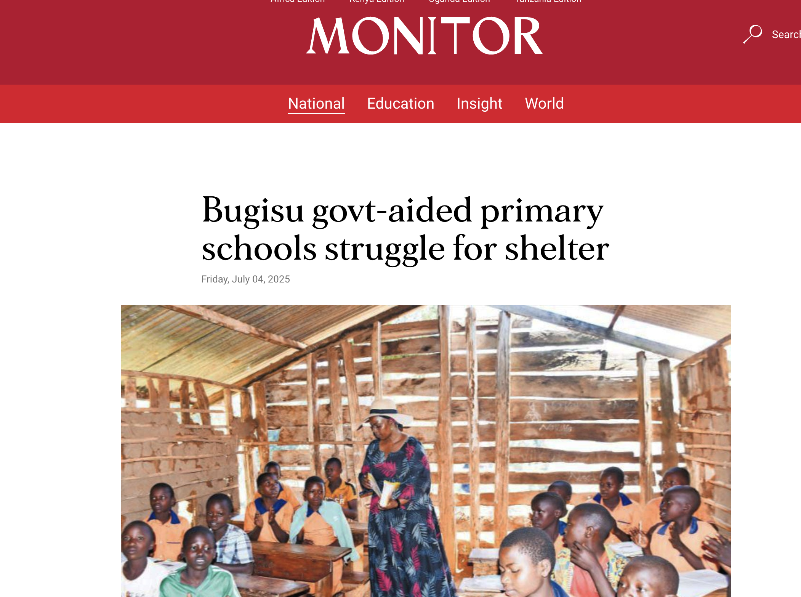
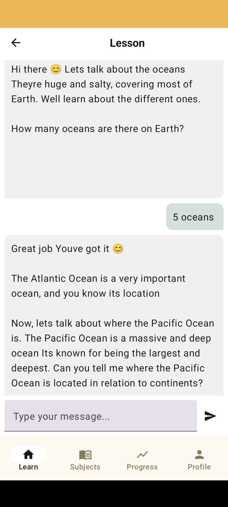
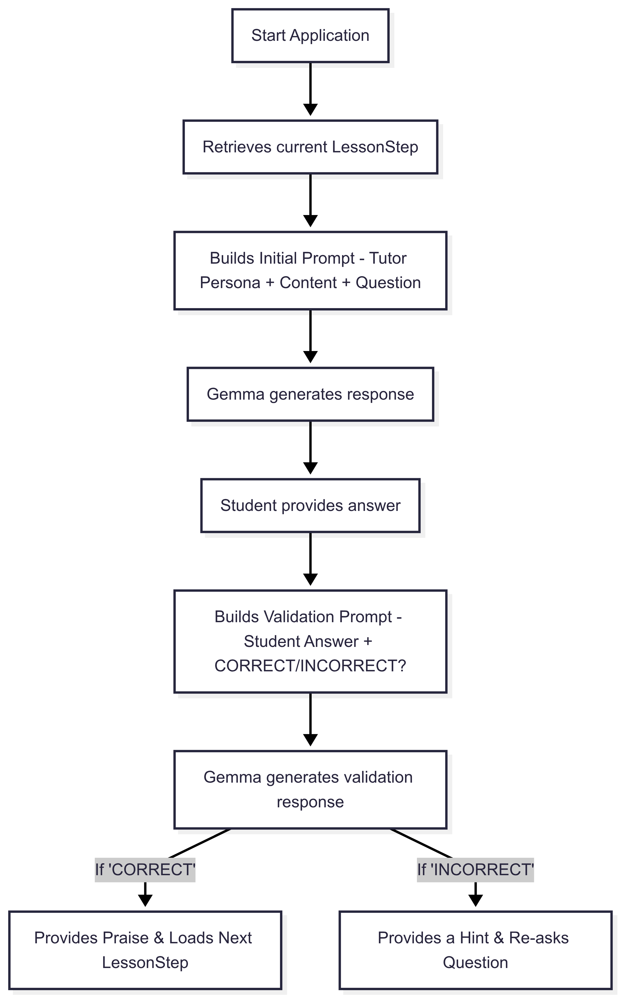

I recently took part in the [Google Gemma 3n hackathon](https://www.kaggle.com/competitions/google-gemma-3n-hackathon) which inspired me to explore the exciting possibilities of on-device machine learning. 
I built an educational application targeting primary school students after reading a [Daily monitor article](https://www.monitor.co.ug/uganda/news/national/bugisu-govt-aided-primary-schools-struggle-for-shelter-5106232) that highlighted the challenges faced by teachers and students in Eastern Uganda under the Universal Primary Education program. 
This article's publication coincided with the start of the competition, creating a powerful sense of purpose.

I've always been passionate about learning and access to quality education. This competition provided the perfect opportunity to begin building a solution that has the potential to revolutionize the education sector in Uganda.

While the competition's one-month timeline was tight and coincided with a particularly busy period at my job, I was determined to submit a foundational proof-of-concept. My goal was to share the project publicly, get valuable feedback, and create the momentum to continue its development. Now that the competition is complete, I plan to continue working on AcuGemma and eventually get it into the hands of real pupils.

In this article, I will describe what the app does and its technical details. I'll also outline the planned improvements to get it to a point where it is ready for actual users. You can follow the development of this project on GitHub.

# The Problem: An Education Crisis

The idea for AcuGemma was born from a stark reality. A newspaper article published by the Daily Monitor highlighted the severe challenges faced by schools in Eastern Uganda under the Universal Primary Education program. 
The report detailed how teachers and students in the Bugisu sub-region were struggling with a severe lack of basic infrastructure. Classrooms, if they existed at all, were often makeshift structures or in a state of disrepair.

This forced a difficult choice: to teach students under open-air conditions—often beneath trees—which was risky, especially during the rainy season. 
A teacher from a school in the region was quoted as saying, "We have no choice but to teach learners under trees, which is risky especially during the rainy season." These conditions had a direct and detrimental effect on learning. A concerned parent noted that "children now come late and leave early because they can't stay under the sun the whole day. It's affecting their learning." 
This crisis creates a distraction-filled environment that prevents effective learning during a child’s foundational years.

This problem highlighted a clear need for a solution that could provide consistent, quality education without relying on physical infrastructure. While technology can't replace a classroom, it can offer a powerful tool to bridge this gap. This realization was the spark that led to the creation of AcuGemma.

# The Solution: Introducing AcuGemma

AcuGemma was developed as a direct response to this educational gap. It is an interactive Android application that serves as a personalized AI tutor, designed specifically to support primary school students. 
While the app's ultimate goal is to be lightweight and highly accessible, the current version stands at approximately 2.4 GB due to bundling the powerful Gemma 3n model for on-device inference. 
This design choice, while creating a challenge for download size, ensures that the tutoring experience is completely private and works anywhere, anytime, without an internet connection.

The app's interface is clean and straightforward, making it accessible even to young learners. It currently offers lessons in foundational subjects like mathematics and basic geography, with a clear roadmap to add more subjects later on. 
By bringing the tutoring experience directly to the student's device, AcuGemma acts as a portable, always-available learning companion, ensuring that every child has access to quality educational support, no matter their circumstances.

This approach addresses the problem on a fundamental level, offering a powerful tool that can be used anywhere, anytime. 
It’s not just a digital textbook; it's an interactive partner that guides, assesses, and encourages, helping to fill the void left by a lack of traditional learning resources.

# The technology under the hood
The true innovation of AcuGemma lies in its carefully considered technical architecture. This project is not about simply putting an LLM in an app; it's about transforming a powerful but general model into a highly controlled and effective educational tutor.

## On-Device with Gemma 3n
The foundation of AcuGemma is the Gemma 3n large language model, which I integrated directly into the application. I leveraged the MediaPipe LLM Inference API to enable inference to run entirely on the Android device's CPU or GPU. 
This architectural choice delivers three critical benefits that directly address the problem I'm solving:

- Enhanced User Privacy: All sensitive conversation data remains on the user's device, ensuring privacy and trust.

- Zero Latency: Responses are generated instantaneously, as there is no network round-trip. This creates a natural, fluid conversational experience that keeps students engaged.

- Offline Capability: The application functions fully without an internet connection, making it ideal for underserved communities with limited or no connectivity.

## Dynamic Prompting Strategy
The core innovation of AcuGemma is its dynamic prompting system, a sophisticated framework that transforms the Gemma 3n model from a generic chatbot into a highly controlled and effective tutor. 
This strategy systematically addresses the limitations of a smaller, on-device model, such as inconsistency and topic drift, by providing a structured, step-by-step learning path.

At the heart of this system is a modular `LessonStep` data model. This lightweight structure breaks down each lesson into granular, manageable steps, giving the application complete control over the content, questions, and conversational flow. 
I should note that this strategy is still a work in progress, and the model's performance on it is not yet perfect. I am actively exploring and making improvements to this system to achieve the desired level of pedagogical control.

## AI-Based Answer Validation
A key challenge for any automated tutoring system is validating a student's response. 
Direct string matching is brittle and prone to failure (e.g., "two" versus "2"). My solution was to use the Gemma model itself as an intelligent validator. 
After a student provides an answer, a second prompt is sent to the model, which includes the student's response and asks the model to respond with "CORRECT" or "INCORRECT." 
This approach is far more robust than traditional methods and allows the system to provide more nuanced and helpful feedback.

# Overcoming Technical Challenges
The engineering journey for AcuGemma is ongoing, and many of the challenges I faced are now key areas for future improvement on the path to version 1. 
The solutions described below represent the current state of the application, serving as a solid foundation for the project's continued development.

1. Implementing a Guided Learning Flow
    **Challenge**: Initially, my approach of using a single, broad prompt for an entire lesson proved to be ineffective. The Gemma 3n model would frequently diverge from the intended lesson path or provide inconsistent responses that were not suitable for a structured tutoring format.

    **Solution**: I addressed this by designing the `LessonStep` data model and implementing a dynamic prompting strategy. 
    This foundation allows me to break down lessons into atomic, pre-defined steps, giving me precise control over the conversation. 
    While this approach has significantly improved the AI's tutoring capabilities, it is still a major area of focus as I continue to refine the prompts to ensure flawless, turn-by-turn guidance.
2. Robust Answer Validation: I developed a two-phase prompting system where the AI itself validates the student's answer. This approach is far more robust than simple string matching.
3. Model Size:
    **Challenge**: The `.task` model file, at over 2 GB, presents a significant practical challenge by substantially increasing the application's APK size. 
    This impacts download times and device storage, which is a critical consideration for our target audience.
    **Solution**: For the current version, I addressed this by positioning the app as a high-value, self-contained download, emphasizing its offline capability as a core feature. For future versions, I plan to explore solutions such as finetuning Gemma specifically for the app's use case to potentially create a more efficient model, and quantizing the model to an even smaller size.

# Looking Ahead: The Future of AcuGemma
AcuGemma Version 0.1 is a foundational step, a proof-of-concept that demonstrates the immense potential of on-device AI for education. But the journey has just begun. 
My ultimate goal is to evolve this project into a robust, impactful tool that can genuinely transform the learning experience for thousands of students.

The immediate roadmap for AcuGemma includes:
- **Expanding Content and Subjects**: The current version is limited to mathematics and basic geography. I plan to significantly expand the library of lessons and add more foundational subjects to create a comprehensive curriculum.

- **Exploring Adaptive Learning**: I want to move beyond a linear, step-by-step curriculum. Future versions will explore adaptive learning paths that can dynamically adjust to a student's performance, providing more support on difficult topics and accelerating progress on concepts they've already mastered.

**User Testing and Feedback**: The most crucial next step is to get the application into the hands of actual students and teachers in Uganda. This will provide invaluable feedback on the user experience, the effectiveness of the lessons, and the real-world impact of the technology. Their insights will be instrumental in shaping the future of AcuGemma.

**Model Optimization**: As mentioned, reducing the app's size is a top priority. I will be actively working on finetuning and quantizing the Gemma model to create a much lighter download, making the application accessible on a wider range of devices and for communities with limited network bandwidth.

AcuGemma is more than just a coding project; it's a mission to use technology to level the educational playing field. 
By empowering young learners with a private, personalized tutor that fits in their pocket, we can help them build the foundational skills they need to succeed, regardless of their circumstances. 
This is the vision that will continue to drive AcuGemma forward.

You can follow the development of this project on the [AcuGemma Github Repo](https://github.com/cmplx-xyttmt/acu-gemma).

---

**Disclaimer**: This article was written with the assistance of an AI. However, the core thoughts, engineering, and goals of the application are mine, and I take full ownership of the project.